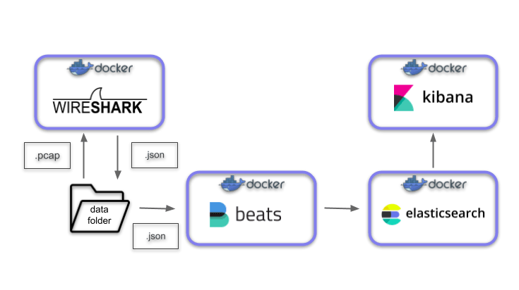

# Overview
L'objectif de ce projet est de proposer une une architecture permettant d'effectuer des analyses de fichier ```.pcap``` grâce à **Kibana**. 

**Qu'est ce qu'un fichier ```.pcap``` ?** 

C'est un type de fichier généré par des logiciels d'enregistrement de trafic réseau comme Wireshark. Ils contiennent des enregistrement de paquet réseau sur une période donnée.

Analyser ces données fichiers peut permettre de faire des reviews du trafic réseau passé, de backtester des algorithmes d'analyse automatique de réseau, etc.. Afin de faciliter leur analyse nous avons décidé de créer une architecture de traitement de ces données, d'indexation et de visualisation grâce à **FileBeat**, **ElasticSearch** et **Kibana**.

# Architecture & Workflow
## Architecture

Toute l'architecture est encapsulée dans des conteneurs [docker](https://www.docker.com/) et orchestrée via [docker compose](https://docs.docker.com/compose/). Cela nous permet d'abstraire facilement les connections réseaux entre les différents composants. L'architecture se présente comme suit:


## Workflow

À la racine de ce projet se trouve un dossier *data* qui contiendra nos fichiers ``` .pcap``` et ``` .json ```. Après avoir copié les fichiers ``` .pcap ``` dans ce dossier, il suffit de lancer la création de l'architecture grâce à [docker compose](https://docs.docker.com/compose/). Le workflow contient deux principales étapes:
- Le conteneur Wireshark lit et transcrit tous les fichiers présents dans le dossier **data/pcaps**. Il génère ensuite plusieurs fichiers ```.json``` qu'il stocke dans le dossier **data/json**.
- Les conteneurs Beat, ElasticSearch et Kibana se lancent en parallèle et se connecte entre eux. Le conteneur Filebeat est chargé de charger les fichiers ``` .json ``` contenus dans le dossier **data/json** dans notre base de données ElasticSearch. Enfin, Kibana permet de communiquer avec ElasticSearch afin de les visualiser efficacement.

# Requirements

* [Docker Engine](https://docs.docker.com/install/) (version 20.10.6)
* [Docker Compose](https://docs.docker.com/compose/install/) (version 1.29.1)
* 1.5 GB de RAM

# Setup
Afin de lancer la stack, veuillez suivre les étapes suivantes:
- copiez les fichiers ```.pcap ``` dans le dossier **data/pcaps**.
- lancez la stack localement grâce à Docker Compose:
```
    $ docker-compose up
```
Attendez quelques minutes que l'architecture se lance et que les fichiers soient transcris.  Vous pouvez accéder à l'interface de Kibana à l'adresse suivante: [http://127.0.0.1:5601](http://127.0.0.1:5601/).

Une fois que vous avez terminé vous pouvez stopper les conteneurs:
```
    $ docker-compose down
```
**Note**: vous pouvez utiliser l'option ```-v``` si vous souhaitez supprimer les données persistantes créées par les volumes de Docker.

# Exemple
- fichier utilisé

### Création de l'index pattern
Une fois que les données sont chargées dans **ElasticSearch**, vous devriez pouvoir créer un [Index Pattern](https://www.elastic.co/guide/en/kibana/current/index-patterns.html) depuis l'interface de **Kibana**. Sélectionnez la source provenant de **Filebeat** puis le Time field *@timestamp* (correspond au timestamp d'envoie des données par FileBeat). Une fois que cela est fait on peut analyser notre donnée grâce à l'onglet **Discover** ou alors en créant un dashboard personnalisé.

**Note**: un index est l'équivalent d'une table dans une base de données relationelles (cf. [Mapping SQL/ElasticSearch](https://www.elastic.co/guide/en/elasticsearch/reference/current/_mapping_concepts_across_sql_and_elasticsearch.html)).
### Exemple de dashboard
alalalala


# Notes
Initialement, je voulais utiliser [Packetbeat](https://www.elastic.co/fr/beats/packetbeat) afin de transcrire les fichiers ```.pcap``` et de les charger directement dans **ElasticSearch**. En effet, PacketBeat est utilisé pour enregistrer des flux réseaux et de les charger automatiquement dans ElasticSearch.

Malheureusement, je ne suis pas arrivé à faire fonctionner correctement l'architecture. Vous pouvez retrouver le projet correspondant dans le dossier **elk-packetbeat/**. Si vous exécutez ce projet (de la même manière que le précédent) vous serez en mesure de visualiser, grâce à Kibana, l'activité réseau de votre ordinateur en temps réel.

# Références
- https://www.elastic.co/blog/analyzing-network-packets-with-wireshark-elasticsearch-and-kibana
- https://github.com/deviantony/docker-elk